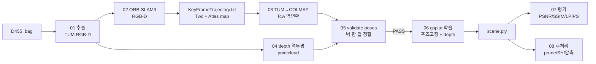

# XR-Splat

> Decoupled SLAM + Gaussian Splatting 파이프라인 — XR용 실사급 공간 자산(.ply)을 구축한다.
> ORB-SLAM3(로컬라이제이션)와 gsplat(실사화)을 분리하고, SLAM 포즈를 **고정 입력**으로 학습한다.

<!-- TODO: 티저 (최종 렌더링 GIF / before-after) — docs/assets -->

## Pipeline


## Why decoupled?
coupled 방식(SplaTAM/GS-SLAM/Photo-SLAM/LoopSplat)은 품질·정확도·속도가 미달 → 역할 분리.
두 맵이 동일 SLAM 포즈에서 나와 좌표계를 자동 공유한다. 상세: [docs/research-note.md](docs/research-note.md).

## Installation
WSL2(Ubuntu) 전제. <!-- TODO: environment.yml / ORB-SLAM3 빌드 / 트러블슈팅 -->
```bash
conda env create -f environment.yml   # 또는 staged: build_xrsplat_env.sh
# ORB-SLAM3: third_party/ORB_SLAM3 (submodule) 빌드 — docs 추가 예정
```

## Usage
<!-- TODO: 캡처 → 01~08 Quick Start (복붙 가능한 명령 블록) -->

## Results
<!-- TODO: 정량 표 (COLMAP 포즈 vs ORB 포즈 PSNR/SSIM/LPIPS, ATE) + 데모 .ply (Releases) -->

## Repository structure
`scripts/` 파이프라인 단계(CLI) · `pipeline/` 공유 모듈 · `configs/` 설정 ·
`third_party/ORB_SLAM3` (submodule) · `data/`·`outputs/` (gitignore).

## Third-party licenses
- **ORB-SLAM3** (GPLv3): 별도 프로세스로 실행, submodule 참조. 자체 코드는 MIT.
- **gsplat** (Apache 2.0). 원조 Inria 3DGS 코드 사용 시 비상업 연구용 제한 고지.

## Acknowledgements
<!-- TODO -->
