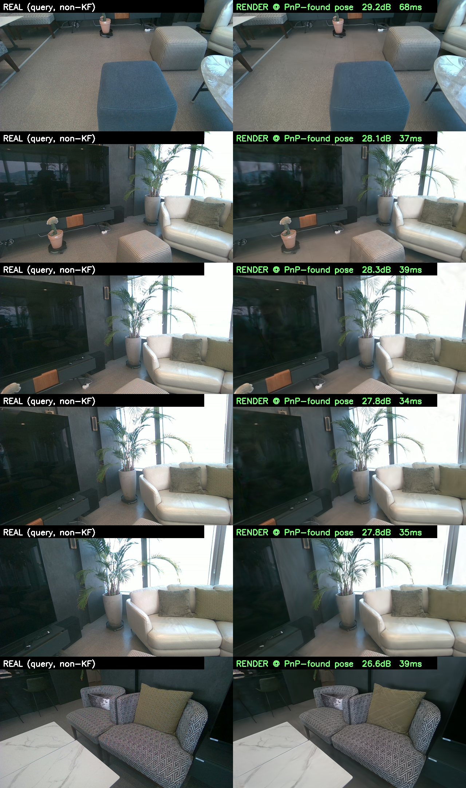
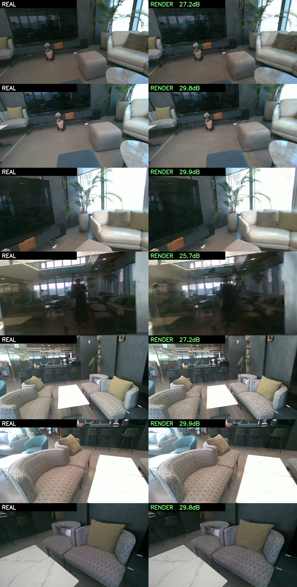
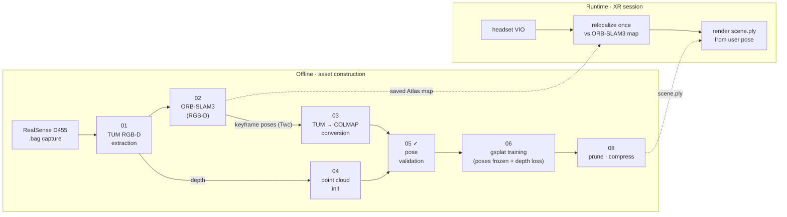

<div align="center">

# xr-splat

**Decoupled SLAM × Gaussian Splatting pipeline for photorealistic XR spaces**

*Track with ORB-SLAM3. Render with gsplat. Share one coordinate frame.*

[](https://huggingface.co/spaces/ingon1/xr-splat-demo)
[](https://www.python.org/)
[](https://pytorch.org/)
[](https://developer.nvidia.com/cuda-toolkit)
[](#installation)
[](#license)

<br>


*Fly-through of the reconstructed **TUM fr1/desk** scene — gsplat, frozen ORB-SLAM3 poses.*

</div>

---

## What is this?

**Scan a room once with a depth camera → get a photorealistic 3D copy you can re-enter later.**

xr-splat turns a single RGB-D recording into two artifacts that live in **one shared coordinate system**:

1. **A photorealistic 3D asset** — a Gaussian-Splatting `.ply` of the space, rendered at **123 FPS**.
2. **An indoor "GPS" for that asset** — show it any new photo of the room and it answers *"this was taken exactly here"* at **63 FPS** on CPU, no initial guess needed, then re-renders the room from that exact spot.

Why both together: an XR headset re-entering the space relocalizes against the map and draws the photoreal world from its true pose with **zero alignment steps** — the map used for *finding yourself* and the map used for *drawing the world* are the same frame by construction.

| You provide | You get |
|---|---|
| One RGB-D recording — RealSense `.bag`, or a TUM / Replica dataset folder | `scene.ply` photoreal asset (+ compressed `_lite`) · localizer feature map · fly-through video & render gallery · quality metrics · an automated **XR-ready verdict** |

## See it

<div align="center">


*Frames the map has never seen (left) → feature-PnP finds each pose → the Gaussian asset rendered at that pose (right).*

<br><br>



*Real capture vs render — own D455 home asset, 27.96 dB median on held-out views.*
</div>

More evidence in [`docs/assets/report/`](docs/assets/report/): [full-map localization (28.8 m)](docs/assets/report/localization_full_map.png) · [merged-map summary](docs/assets/report/merged_map_summary.png) · [quality A/B (MCMC)](docs/assets/report/quality_mcmc_AB.png) · [runtime loop state machine](docs/assets/report/runtime_loop_state.png)

## Why decoupled?

Coupled Gaussian-SLAM systems (SplaTAM, GS-SLAM, Photo-SLAM, LoopSplat) estimate pose **and** optimize the map on a single Gaussian representation, in real time. In our experiments this traded away everything at once: rendering quality below photorealistic, tracking weaker than mature SLAM, and slow runtimes.

**xr-splat splits the two jobs.** ORB-SLAM3 does what it does best — accurate keyframe poses, loop closure, relocalization. gsplat does what it does best — offline, unconstrained photorealistic optimization. Because the Gaussian map is trained directly on SLAM poses (poses frozen, never in the optimizer), **both maps share one coordinate frame by construction**.

## Pipeline



Every stage is an independent CLI communicating through standard on-disk formats (TUM, COLMAP) — swap any stage without touching the rest. The orchestrator refuses to train until stage 05 pose validation **PASSes** and the frame-integrity check holds, so bad poses never silently become a blurry asset.

## Results

### At a glance

| What | Scene | Result |
|---|---|---|
| SLAM poses good enough for splatting? | TUM fr1/desk (mocap GT) | render gap vs COLMAP SfM **Δ0.13 dB**, ATE **1.9 cm** (beats COLMAP's 2.04) |
| Photoreal quality — real capture | own D455 home | **27.96 dB PSNR** / 0.871 SSIM (28 held-out views) |
| Photoreal quality — clean data | Replica office0 (GT poses¹) | **45.35 dB PSNR** / 0.991 SSIM (63 held-out views) |
| Global relocalization (no pose hint) | home · full 28.8 m map | **100 %** (30/30 and 40/40 unseen frames) |
| Localize speed | feature-PnP, CPU only | **62.8 FPS** (voxel-downsampled map, 2.3× speedup, zero accuracy loss) |
| Render speed | 2M Gaussians @ 1280×720 | **123 FPS** on a single 12 GB consumer GPU (WSL2) |
| XR-ready verdict (automated) | home | **XR_READY** — frame integrity scale 0.999 / rot 0.054° |

¹ Replica is fed its ground-truth trajectory (pipeline stages 03→08); it isolates rendering quality from SLAM error.

**👉 Try it yourself:** the Replica office0 asset (524k-Gaussian web export, 17 MB) is walkable in your browser — [🤗 Live Demo](https://huggingface.co/spaces/ingon1/xr-splat-demo). Client-side WebGL, no server GPU ([how it's deployed](docs/DEPLOY_HF.md)).

### Data is the quality ceiling

Raising the Gaussian cap (2M → 3M) left hold-out PSNR unchanged (27.96 → 27.87), while running the *same pipeline, same cap, same iterations* on clean synthetic data reached **45.35 dB vs 27.96 dB — a +17 dB gap from data alone**. Render quality is rate-limited by capture coverage and sensor quality (exact depth, no motion blur), not by code or Gaussian count. Want a prettier asset? Capture better data.

<details>
<summary><b>M1 — ORB-SLAM3 poses vs COLMAP SfM, public dataset with mocap GT</b></summary>
<br>

The decoupled pipeline is only as good as the poses it is fed, so we render the *same scene* twice — once from ORB-SLAM3 poses, once from COLMAP SfM poses — under an identical protocol and compare.

| Pose source | PSNR ↑ | SSIM ↑ | LPIPS ↓ | ATE ↓ |
|---|---|---|---|---|
| COLMAP SfM (baseline) | 23.98 | 0.836 | 0.198 | 2.04 cm |
| **ORB-SLAM3 (ours)** | 23.85 | 0.834 | 0.207 | **1.89 cm** |
| Δ | **0.13** | 0.002 | 0.009 | — |

> Scene: **TUM RGB-D fr1/desk**. Identical training protocol, common 16-view hold-out, per-view median. ATE is Sim(3)-aligned RMSE against TUM `groundtruth.txt` — the only absolute-accuracy proof (own captures have no mocap). Reproduce with [`scripts/07_evaluate.py`](scripts/07_evaluate.py).

</details>

<details>
<summary><b>Merged-map evidence — why one shared frame actually holds</b></summary>
<br>

Numbers from [`docs/FINAL-METRICS.md`](docs/FINAL-METRICS.md) / [`docs/MERGED-MAP-RESULTS.md`](docs/MERGED-MAP-RESULTS.md), all measured on the home asset:

- **Pose tolerance** — renders punish pose error hard: 1° rotation costs **−7 dB**, 1 cm costs −2.8 dB. This sets the localizer budget (< 1°, ~1 cm) — and the localizers below meet it.
- **Gaussian self-relocalization** — photometric optimization against the asset refines a 5 cm / 3° perturbation to **0.18 cm / 0.05°** (10/10 converged).
- **Convergence basin** — photometric relocalization succeeds from up to 20 cm / 12° initial error (75 %).
- **Operating envelope (70/30 split)** — *inside* captured space: localize ✓ render ✓; *outside*: localization still generalizes (SfM 0.73 cm) but rendering does not extrapolate (10 dB). Capture coverage is the product spec.
- **Runtime loop** — 40-frame tracking replay, 40/40 OK, OK/LOST state machine.

</details>

Demo `.ply` assets will be distributed via [GitHub Releases](../../releases).

## Installation

Tested on **WSL2 (Ubuntu 24.04)** with an NVIDIA GPU (CUDA 12.1).

```bash
git clone --recursive https://github.com/ingon1026/xr-splat.git
cd xr-splat
conda env create -f environment.yml
conda activate xrsplat
```

Build ORB-SLAM3 (submodule, with repo patches applied — **viewer must stay OFF on WSL2**):

```bash
bash third_party/build_orbslam3.sh   # applies repo patches, then builds
```

<details>
<summary><b>WSL2 notes & common build errors</b></summary>

- **RealSense capture**: live USB streaming on WSL2 is unreliable. Record `.bag` files with RealSense Viewer on Windows, then process them offline here (this pipeline is fully offline by design).
- **Pangolin viewer crashes (ZINK/EGL)**: expected on WSLg — all scripts run ORB-SLAM3 headless; success is judged by `KeyFrameTrajectory.txt` output, not exit code.
- **C++ standard build errors**: applied automatically by `third_party/patches/`.

</details>

## Quickstart

One config file per scene is the single source of truth (input path, per-stage knobs, output tags). Copy an example and point it at your recording:

```bash
cp configs/d455_room2.yaml configs/myroom.yaml   # edit: scene name + input.path

# Build everything: 01→08, gated, resumable. Re-runs skip finished stages; --force redoes.
python xrsplat.py build configs/myroom.yaml

# Look at it
python xrsplat.py view myroom                    # 3D Gaussian viewer in the browser

# Re-enter it: where was this photo taken? → pose + render at that pose
python xrsplat.py localize myroom photo.png --render-out here.png
```

Everything lands in `outputs/myroom/`: the asset (`gsplat_mcmc2m/scene.ply` + `_lite`), a results pack (`results/` — fly-through mp4, gallery, localization plots, metrics json) and an XR-readiness report.

| Command | What it does |
|---|---|
| `build <config>` | full offline pipeline + report + results pack (idempotent resume) |
| `showcase <scene>` | regenerate the results pack only (mp4 · gallery · plots · metrics) |
| `report <scene>` | XR-ready gate verdict: `XR_READY` / `RENDER_ONLY` / `FRAME_INVALID` / `NEEDS_RECAPTURE` |
| `view <scene>` | browser 3D viewer |
| `localize <scene> ` | global relocalization for one frame (+ optional render at found pose) |
| `run <scene> <dir>` | localize→render loop over a frame stream (OK/LOST state machine) |

Public datasets work too — `scripts/01_extract_bag.py dir --dataset tum|replica` ingests TUM RGB-D and Replica folders into the same layout ([`data/README.md`](data/README.md)).

<details>
<summary><b>Individual stages (each an independent CLI)</b></summary>
<br>

```bash
python scripts/01_extract_bag.py bag --bag data/raw/room1.bag --out data/processed/room1
bash   scripts/02_run_orbslam3.sh room1              # headless; poses + Atlas map
python scripts/03_tum_to_colmap.py --scene room1     # Twc→Tcw, quaternion reorder
python scripts/04_make_pointcloud.py --scene room1
python scripts/05_validate_poses.py --scene room1    # ← gate: must PASS before training
bash   scripts/06_train_gsplat.sh room1              # poses frozen, depth supervision
python scripts/07_evaluate.py --scene room1
python scripts/08_postprocess.py --scene room1       # prune + SH compress for deployment
```

Legacy per-scene `run_*.sh` drivers still exist but `xrsplat.py build` supersedes them.

</details>

<details>
<summary><b>Training framework notes</b></summary>
<br>

gsplat (`rasterization` + `MCMCStrategy`) with a custom dense-depth loss. Chosen over nerfstudio splatfacto because neither ships turnkey dense per-pixel depth supervision for Gaussians, and gsplat is lighter, pre-verified on torch 2.1.2/cu121, and loads COLMAP directly. Camera poses stay **frozen** — no pose tensors in the optimizer (decoupled by design). `MCMCStrategy` with a 2M Gaussian cap is the adopted path: +4.1 dB over the default strategy at the same budget (23.82 → 27.96).

</details>

## Honest limitations

- **Offline replay, not a live headset yet.** The runtime loop replays recorded frames; wiring a real HMD/VIO stream is the next milestone (M4b).
- **You can only render where you captured.** Free-orbit works inside the captured viewing cone; a narrow capture (e.g. a 0.65 m sweep) shows floaters from un-captured angles — that's missing data, not a broken asset. View narrow scenes via the generated fly-through.
- **Quality ceiling = your capture.** Proven twice: raising the Gaussian cap changes nothing, cleaner data adds +17 dB. Code and hyperparameters won't buy more.
- **Absolute accuracy is proven on TUM only** (1.9 cm ATE vs mocap). Own captures have no ground truth; they are validated by render-vs-real quality, geometric pose validation, and frame-integrity checks instead.

## Repository structure

```
xrsplat.py       single CLI entry point (build · showcase · report · view · localize · run)
pipeline/        config schema (per-scene yaml) · gated resumable orchestrator ·
                 MergedMap runtime API (localize/render/run) · geometry & IO modules
scripts/         pipeline stages 01–08 + localizers, benchmarks, reports, showcase
configs/         one yaml per scene — the single source of truth
tests/ + pytest  28 tests, run without gsplat or a GPU (CI-friendly by design)
third_party/     ORB-SLAM3 as a git submodule + build patches
docs/            FINAL-METRICS.md · operating & capture guides · report assets · decks
data/ outputs/   gitignored — reproduced locally by running the pipeline
```

## Roadmap

- [x] **M0** — scaffolding, ORB-SLAM3 headless build, TUM example run
- [x] **M1** — end-to-end on public dataset, ORB poses vs COLMAP poses ≤ 0.5 dB (Δ 0.13 dB)
- [x] **M2** — own D455 home capture, ORB-frame Gaussian asset, MCMC quality pass
- [x] **M3** — post-processing, results & teaser
- [x] **M4a** — unified `xrsplat` CLI · automated XR-ready report · realtime localize (63 FPS) / render (123 FPS) · public-data validation (Replica 45 dB)
- [ ] **M4b** — live headset pose loop · wider capture coverage

## License

Project code is released under the **MIT License**.

Third-party components keep their own licenses: [ORB-SLAM3](https://github.com/UZ-SLAMLab/ORB_SLAM3) (GPLv3, used as an external process via a git submodule) · [gsplat](https://github.com/nerfstudio-project/gsplat) (Apache 2.0).

## Acknowledgements

Built on the shoulders of [ORB-SLAM3](https://github.com/UZ-SLAMLab/ORB_SLAM3), [gsplat](https://github.com/nerfstudio-project/gsplat), and the original [3D Gaussian Splatting](https://repo-sam.inria.fr/fungraph/3d-gaussian-splatting/) work. Datasets: [TUM RGB-D](https://cvg.cit.tum.de/data/datasets/rgbd-dataset), [Replica](https://github.com/facebookresearch/Replica-Dataset).
