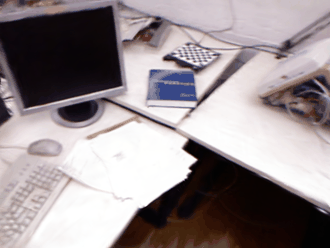
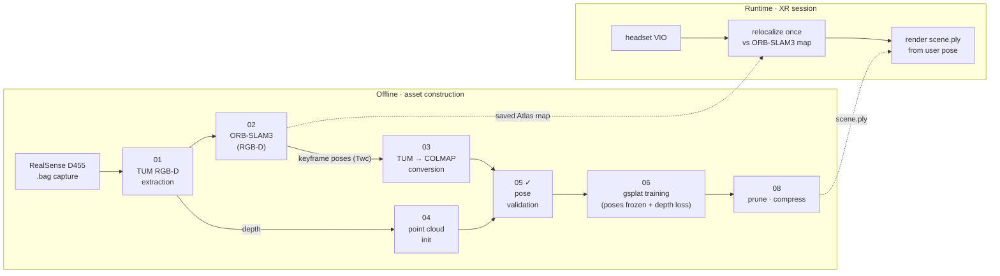

<div align="center">

# xr-splat

**Decoupled SLAM × Gaussian Splatting pipeline for photorealistic XR spaces**

*Track with ORB-SLAM3. Render with gsplat. Share one coordinate frame.*

[](https://www.python.org/)
[](https://pytorch.org/)
[](https://developer.nvidia.com/cuda-toolkit)
[](#installation)
[](#license)

<br>



*Fly-through of the reconstructed **TUM fr1/desk** scene — gsplat, 30k iterations, frozen ORB-SLAM3 poses.*

</div>

---

## Why decoupled?

Coupled Gaussian-SLAM systems (SplaTAM, GS-SLAM, Photo-SLAM, LoopSplat) estimate pose **and** optimize the map on a single Gaussian representation, in real time. In our experiments this traded away everything at once: rendering quality below photorealistic, tracking weaker than mature SLAM, and slow runtimes.

**xr-splat splits the two jobs.** ORB-SLAM3 does what it does best — accurate keyframe poses, loop closure, relocalization. gsplat does what it does best — offline, unconstrained photorealistic optimization. Because the Gaussian map is trained directly on SLAM poses, **both maps share one coordinate frame by construction**: at runtime, a relocalized pose drops straight into the Gaussian renderer with zero alignment steps.

## Pipeline



Every stage is an independent CLI script communicating through standard on-disk formats (TUM, COLMAP) — swap any stage without touching the rest.

## Results

**Milestone M1 — public-dataset end-to-end validation.** The decoupled pipeline is only as
good as the poses it is fed, so we render the *same scene* twice — once from ORB-SLAM3 poses,
once from COLMAP SfM poses — under an identical protocol and compare. The gap is **0.13 dB**
(well within the ≤ 0.5 dB bar), and ORB-SLAM3's absolute trajectory error is actually *lower*
than COLMAP's, confirming the SLAM poses are a sound foundation for Gaussian Splatting.

| Pose source | PSNR ↑ | SSIM ↑ | LPIPS ↓ | ATE ↓ |
|---|---|---|---|---|
| COLMAP SfM (baseline) | 23.98 | 0.836 | 0.198 | 2.04 cm |
| **ORB-SLAM3 (ours)** | 23.85 | 0.834 | 0.207 | **1.89 cm** |
| Δ | **0.13** | 0.002 | 0.009 | — |

> Scene: **TUM RGB-D fr1/desk**. Both models trained with the identical protocol — gsplat
> **15k iterations**, `--refine-stop 7000` (densification stop) + means grad-clip, dense
> depth supervision. Evaluated on a **common 16-view hold-out** (every 8th keyframe, same
> indices for both, intersection only). PSNR/SSIM/LPIPS are the **per-view median**
> (worst-view PSNR: ORB 20.22 / COLMAP 20.11). ATE is the Sim(3)-aligned RMSE of keyframe
> centers against TUM `groundtruth.txt`. Reproduce with
> [`scripts/07_evaluate.py`](scripts/07_evaluate.py) (writes `outputs/<scene>/eval_m1.json`).

Demo `.ply` assets will be distributed via [GitHub Releases](../../releases).

## Installation

Tested on **WSL2 (Ubuntu 24.04)** with an NVIDIA GPU (CUDA 12.1).

```bash
git clone --recursive https://github.com/ingon1026/xr-splat.git
cd xr-splat
conda env create -f environment.yml
conda activate xrsplat
```

Build ORB-SLAM3 (submodule, with repo patches applied — **viewer must stay OFF on WSL2**):

```bash
bash third_party/build_orbslam3.sh   # applies repo patches, then builds
```

<details>
<summary><b>WSL2 notes & common build errors</b></summary>

- **RealSense capture**: live USB streaming on WSL2 is unreliable. Record `.bag` files with RealSense Viewer on Windows, then process them offline here (this pipeline is fully offline by design).
- **Pangolin viewer crashes (ZINK/EGL)**: expected on WSLg — all scripts run ORB-SLAM3 headless; success is judged by `KeyFrameTrajectory.txt` output, not exit code.
- **C++ standard build errors**: applied automatically by `third_party/patches/`.

</details>

## Usage

```bash
# 1. Extract capture → TUM RGB-D layout (also accepts TUM/Replica datasets directly)
python scripts/01_extract_bag.py --input data/raw/room1.bag --scene room1

# 2. Run ORB-SLAM3 (headless) → keyframe poses + Atlas map
bash scripts/02_run_orbslam3.sh room1

# 3. Convert poses to COLMAP format (Twc→Tcw, quaternion reorder)
python scripts/03_tum_to_colmap.py --scene room1

# 4–5. Build init point cloud, then validate pose conversion  ← gate: must PASS
python scripts/04_make_pointcloud.py --scene room1
python scripts/05_validate_poses.py --scene room1

# 6. Train gsplat (poses frozen, depth supervision on)
bash scripts/06_train_gsplat.sh room1

# 7–8. Evaluate, then prune/compress for XR deployment
python scripts/07_evaluate.py --scene room1
python scripts/08_postprocess.py --scene room1
```

Data and outputs are **not** stored in this repo — see [`data/README.md`](data/README.md) for how to obtain public datasets (TUM RGB-D, Replica) or capture your own.

**Training framework (Phase 5):** gsplat (`rasterization` + `DefaultStrategy`) with a custom dense-depth loss. Chosen over nerfstudio splatfacto because neither ships turnkey dense per-pixel depth supervision for Gaussians (gsplat exposes depth rendering; splatfacto's depth loss is nerfacto-only), and gsplat is lighter, pre-verified on torch 2.1.2/cu121, and loads COLMAP directly. Camera poses stay **frozen** — no pose tensors in the optimizer (decoupled by design).

## Repository structure

```
configs/        ORB-SLAM3 & training configs (auto-generated from capture intrinsics)
scripts/        pipeline stages 01–08, each an independent CLI
pipeline/       shared modules (format conversion, geometry utils)
third_party/    ORB-SLAM3 as a git submodule + build patches
docs/           research notes, capture guide, README assets
data/ outputs/  gitignored — reproduced locally by running the pipeline
```

## Roadmap

- [x] **M0** — scaffolding, ORB-SLAM3 headless build, TUM example run
- [x] **M1** — end-to-end on public dataset, ORB poses vs COLMAP poses ≤ 0.5 dB (Δ 0.13 dB)
- [ ] **M2** — end-to-end on own D455 capture
- [x] **M3** — post-processing, results & teaser
- [ ] **M4** — public release

## License

Project code is released under the **MIT License**.

Third-party components keep their own licenses: [ORB-SLAM3](https://github.com/UZ-SLAMLab/ORB_SLAM3) (GPLv3, used as an external process via a git submodule) · [gsplat](https://github.com/nerfstudio-project/gsplat) (Apache 2.0).

## Acknowledgements

Built on the shoulders of [ORB-SLAM3](https://github.com/UZ-SLAMLab/ORB_SLAM3), [gsplat](https://github.com/nerfstudio-project/gsplat), and the original [3D Gaussian Splatting](https://repo-sam.inria.fr/fungraph/3d-gaussian-splatting/) work. Datasets: [TUM RGB-D](https://cvg.cit.tum.de/data/datasets/rgbd-dataset), [Replica](https://github.com/facebookresearch/Replica-Dataset).
