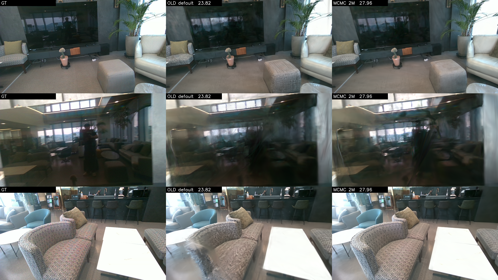
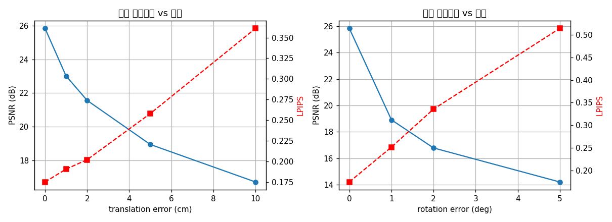
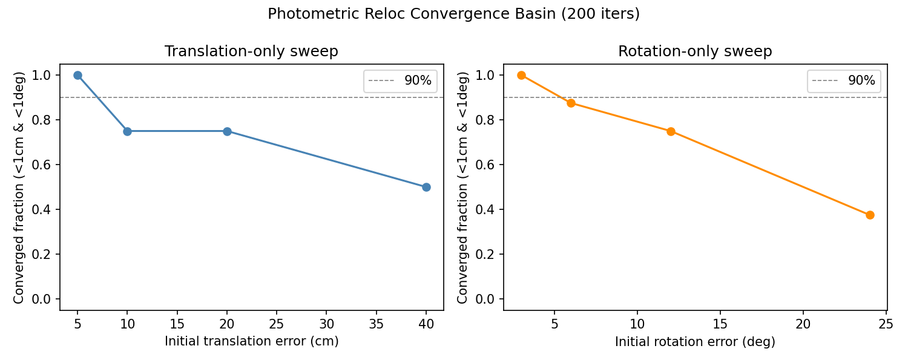
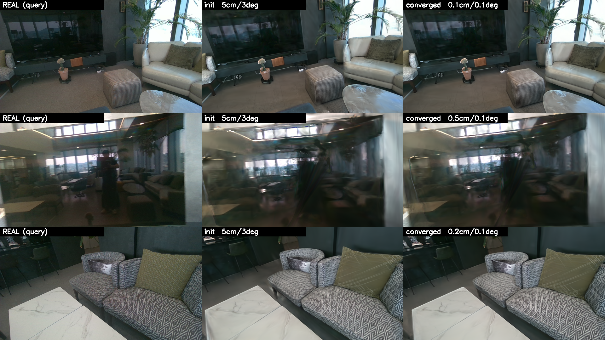
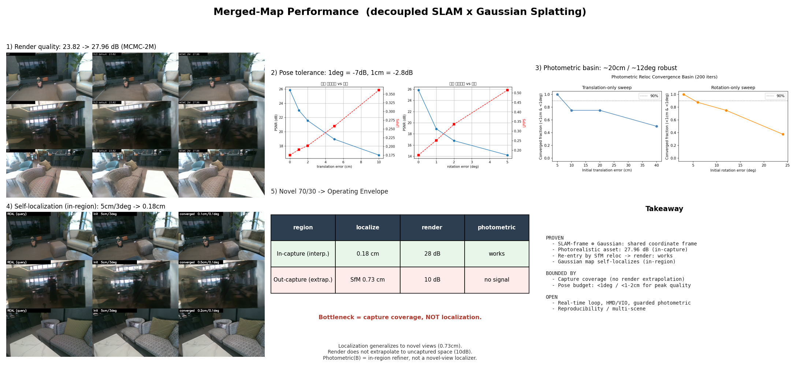

# Merged-Map Performance Results

**한 줄 결론:** decoupled SLAM(ORB-SLAM3) + Gaussian(gsplat MCMC-2M) 합쳐진 맵은 **찍은 공간 안에서** 렌더링 27.96 dB / SSIM 0.871과 포토메트릭 자가 위치추정(5 cm/3° → 0.18 cm/0.05°, 10/10)을 달성한다. 70/30 외삽 테스트로 **동작 범위**도 확인했다: **위치추정은 새 시점으로 일반화(SfM 0.73 cm)되지만 렌더는 안 찍은 공간으로 외삽되지 않는다(PSNR 10) — 율속은 위치추정이 아니라 캡처 커버리지다.** 실시간화·HMD·커버리지 확장은 열린 문제.

---

## 1. 렌더링 품질 (MCMC-2M vs Default)

| 설정 | PSNR (dB) | SSIM | LPIPS | 비고 |
|------|-----------|------|-------|------|
| Default | 23.82 | — | — | 기존 baseline |
| MCMC-2M | **27.96** | **0.871** | **0.267** | 홀드아웃 28뷰 |

**해석:** +4.14 dB 향상은 MCMC strategy 단독 효과가 아니라 refine-stop · learning-rate decay · 정규화 구성 변경의 복합 결과다. "MCMC = +4 dB"로 단순화하지 말 것.

---

## 2. 포즈 허용오차 (Pose Sensitivity)

*평가 조건: 12프레임 × 4방향, 기준 PSNR 25.84 dB (포즈 오차 0)*

| 오차 종류 | 크기 | PSNR (dB) | 기준 대비 |
|-----------|------|-----------|-----------|
| 회전 | 1° | 18.91 | −6.93 dB |
| 회전 | 2° | 16.78 | −9.06 dB |
| 회전 | 5° | 14.20 | −11.64 dB |
| 이동 | 1 cm | 23.01 | −2.83 dB |
| 이동 | 2 cm | 21.56 | −4.28 dB |
| 이동 | 5 cm | 18.94 | −6.90 dB |
| 이동 | 10 cm | 16.71 | −9.13 dB |

**해석:** 회전이 이동보다 훨씬 민감하다. 1° 회전 오차만으로 −7 dB 급락. localizer 정밀도 예산: **회전 <1°, 이동 <1–2 cm** 이내여야 PSNR 저하가 3 dB 미만으로 유지된다.

---

## 3. 수렴 Basin (Photometric Reloc basin sweep)

*평가 조건: 8프레임, 200 iters, 수렴 기준 trans <1 cm · rot <1°*

### 이동 오차만
| 초기 오차 | 수렴율 | 최종 trans (cm) | 최종 rot (°) | 최종 PSNR |
|-----------|--------|-----------------|--------------|-----------|
| 5 cm | **100%** | 0.15 | 0.04 | 25.78 |
| 10 cm | 75% | 0.20 | 0.05 | 25.19 |
| 20 cm | 75% | 0.20 | 0.06 | 25.46 |
| 40 cm | 50% | 0.81 | 0.08 | 24.23 |

### 회전 오차만
| 초기 오차 | 수렴율 | 최종 trans (cm) | 최종 rot (°) | 최종 PSNR |
|-----------|--------|-----------------|--------------|-----------|
| 3° | **100%** | 0.15 | 0.04 | 25.78 |
| 6° | 88% | 0.18 | 0.04 | 25.74 |
| 12° | 75% | 0.27 | 0.06 | 25.40 |
| 24° | 38% | 1.33 | 0.54 | 24.04 |

**해석:** 포토메트릭 최적화 자체는 ~20 cm / ~12° 수준의 초기 오차까지 75% 이상 수렴하므로 거친 localizer를 허용한다. 단, 2절의 포즈 민감도와 조합하면 **수렴 후 오차가 1° / 1 cm 미만이어야 품질이 유지**된다는 제약은 변하지 않는다.

---

## 4. Gaussian 맵 자가 위치추정 (Photometric Reloc)

*평가 조건: 10프레임, 300 iters, 초기 오차 5 cm / 3°*

| 항목 | 초기값 | 최종값 |
|------|--------|--------|
| 이동 오차 | 5.0 cm | **0.18 cm** |
| 회전 오차 | 3.0° | **0.05°** |
| PSNR | 15.55 dB | **25.91 dB** |
| 수렴율 | — | **10/10 (100%)** |

**해석:** 동일한 Gaussian 맵 하나로 렌더링(품질)과 포토메트릭 위치추정(포즈 추정) 두 기능을 모두 수행할 수 있음을 확인. 단 초기 추정치가 ~5 cm / 3° 이내여야 하므로 coarse localizer와 조합이 전제다. **중요 한계(§5):** 이 결과는 *찍은 공간 안*(맵이 잘 렌더하는 영역)에서만 성립한다 — 안 찍은 새 시점에선 맵이 렌더를 못 해 photometric 신호가 사라지므로 작동하지 않는다. 즉 B는 *범용 새-시점 로컬라이저가 아니라 in-region 미세조정기*다.

---

## 5. 새 시점 일반화 (Novel 70/30) — 동작 범위(envelope)

*조건: 궤적 앞 70%(156 KF)로 COLMAP+가우시안 재구성, 뒤 30%(68 KF)를 학습·ref 모델 둘 다에서 제외한 진짜 새 시점. novelty(최근접 ref 카메라 거리) median **60.8 cm**(범위 2.3–88.8). 누출 아님(등록 포즈가 전체모델 포즈와 다르고 깊을수록 오차 증가 확인).*

**중요:** 70/30은 궤적 뒤 구간을 *통째로* 들어내므로 **안 찍은 공간으로의 외삽**을 테스트한다. 이는 thesis 본래 use-case(*찍은 공간에 다른 포즈로 재진입*)가 아니라 그 바깥 경계다.

| novelty 구간 | 거친 SfM 등록 | render PSNR | photometric 정밀화 후 |
|---|---|---|---|
| 0–15 cm (n=6) | 0.08 cm | 19.9 | 0.33 cm / 20.0 dB (중립) |
| 15–30 cm (n=5) | 0.20 cm | 11.4 | 0.73 cm / 11.5 dB |
| 30–50 cm (n=11) | 0.56 cm | 9.8 | **20.3 cm** / 12.1 dB (발산) |
| 50+ cm (n=46) | 1.25 cm | 10.5 | **21.8 cm** / 14.1 dB (발산) |
| **전체 median** | **0.73 cm / 0.28°** (68/68 등록) | **10.5** | 14.4 cm (55/68 악화) |

**동작 범위 요약:**

| 구역 | 위치추정 | 렌더 | photometric(B) |
|---|---|---|---|
| 찍은 공간 안 (보간; §4) | ✓ 0.18 cm | ✓ 28 dB | ✓ 작동 |
| 안 찍은 공간 (외삽; 이 실험) | ✓ SfM 0.73 cm | ✗ 10 dB | ✗ 신호 없음 |

**해석 (정직):**
- **병목은 위치추정이 아니라 캡처 커버리지다.** 포즈오차 0.73 cm는 §2 곡선상 −1~2 dB짜리인데 실제 PSNR은 10 → 손실의 ~13 dB가 "맵에 그 공간 기하가 없음" 탓.
- **위치추정은 새 시점으로 일반화**: SfM 등록 68/68, median 0.73 cm(깊을수록 3~8 cm로 *완만히* 저하). 렌더가 절벽처럼 떨어지는 것과 대조.
- **photometric 정밀화(B)는 외삽 구간에서 무력**: 55/68 악화, 깊은 구간 0.56→20 cm. 단 "14 cm가 불가피"가 아니라 **"도울 수 없고 가드 없으면 해를 끼침"** — 맵이 PSNR 10으로밖에 못 그리는 곳엔 photometric 신호 자체가 없어 옵티마이저가 엉뚱한 저-loss 포즈로 감(**PSNR 10→14 오르는데 포즈 1.3→22 cm 악화** = 그 증거). → **B는 찍은 공간 안의 미세조정기지 범용 새-시점 로컬라이저가 아님.** 재진입은 정통 A(SfM→render)가 떠받침.

---

## 종합 그림

*패널 구성: (1) 품질 A/B, (2) 포즈 민감도 곡선, (3) 수렴 basin, (4) 자가 위치추정 before/after, (5) 70/30 동작 범위 envelope*

---

## 남은 것

- **실시간화**: 현재 학습 ~수십 분, 포토메트릭 reloc 300 iters/프레임 → 실시간 불가. 온라인 Gaussian 업데이트·빠른 렌더 pipeline 필요.
- **HMD**: 헤드 모션 특성(빠른 회전, 큰 시점 변화)에서 basin이 충분히 넓은지 미확인.
- **재현성**: 단일 시퀀스(ros2_bag2_home_rgbd_orbframe) 결과. 다른 장면·조명·카메라 모델에서 동일 경향인지 검증 필요.
- **캡처 커버리지(율속, §5)**: 안 찍은 공간은 렌더 외삽이 안 됨(PSNR 10). XR "어디든 걸어가기"엔 더 촘촘·넓은 캡처가 해법 — 알고리즘이 아니라 데이터 문제.
- **가드형 photometric(future work)**: 외삽 구간 발산 방지를 위해 init으로 정규화(do-no-harm) + render 신뢰도(불확실 영역 마스킹) 추가. 이번엔 미구현.
